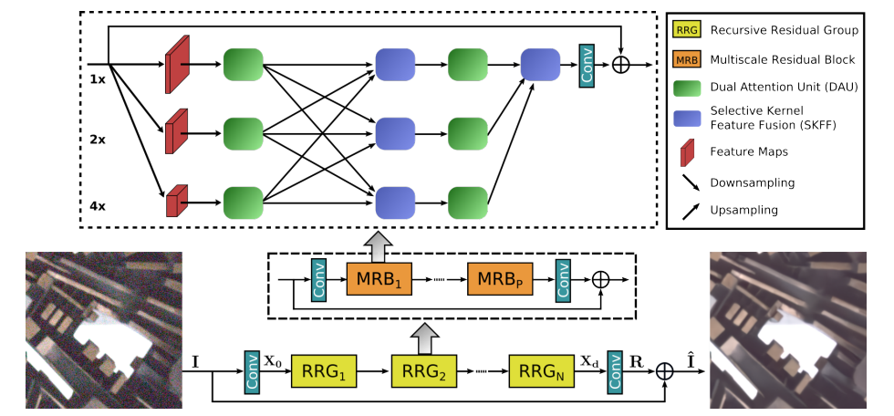
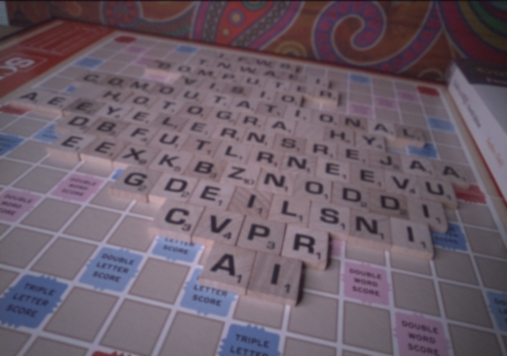
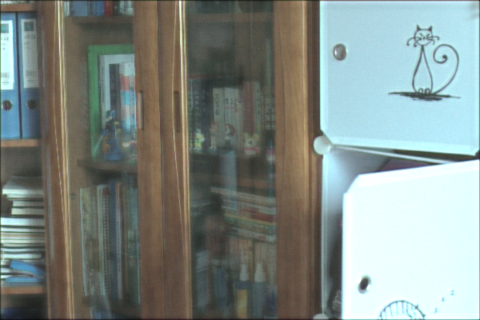
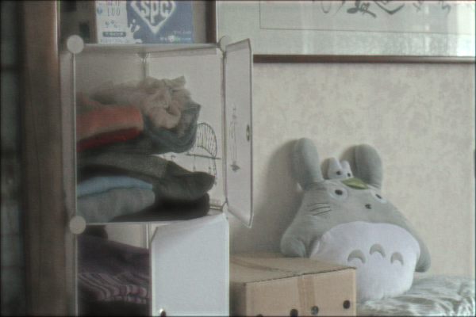
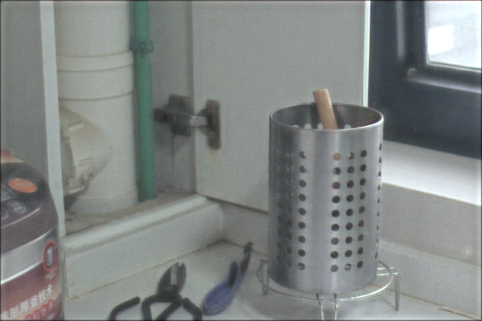

# MIRNet
Learning Enriched Features for Real Image Restoration and Enhancement

## Content
- [MIRNet](#MIRNet)
- [Getting Started](#getting-tarted)
- [Running](#running)
- [Result](#result)
- [References](#references)
- [Citations](#citation)

## Getting Started

- Clone the repository

### Prerequisites

- Tensorflow 2.2.0+
- Python 3.6+
- Keras 2.3.0
- PIL
- numpy

```python
pip install -r requirements.txt
```

## Running
### Image Denoising
#### Training
- Get the dataset
    ```
    wget https://competitions.codalab.org/my/datasets/download/a26784fe-cf33-48c2-b61f-94b299dbc0f2
    ```
- Training 
    ```
    python train_denoise.py
    ```
#### Testing
- Test
    ```
    python test_denoise.py
    ```
### Usage
```
usage: train_denoise.py [-h] [--lr LR] [--gpu GPU]
                        [--grad_clip_norm GRAD_CLIP_NORM]
                        [--num_epochs NUM_EPOCHS]
                        [--train_batch_size TRAIN_BATCH_SIZE]
                        [--checkpoint_ep CHECKPOINT_EP]
                        [--checkpoint_filepath CHECKPOINT_FILEPATH]
                        [--num_rrg NUM_RRG] [--num_mrb NUM_MRB]
                        [--num_channels NUM_CHANNELS]
```
```
optional arguments:
                        -h, --help show this help message and exit
                        --lr LR
                        --gpu GPU
                        --grad_clip_norm GRAD_CLIP_NORM
                        --num_epochs NUM_EPOCHS
                        --train_batch_size TRAIN_BATCH_SIZE
                        --checkpoint_ep CHECKPOINT_EP
                        --checkpoint_filepath CHECKPOINT_FILEPATH
                        --num_rrg NUM_RRG
                        --num_mrb NUM_MRB
                        --num_channels NUM_CHANNELS
```

Download the weight [here](https://drive.google.com/file/d/1iPMYhTSiXrFPK3Pvz1Sn6e2ZeDhYHeSw/view?usp=sharing) and put it to the ```weights/denoise``` folder.
```
usage: test_denoise.py [-h] [--test_path TEST_PATH] [--gpu GPU]
                       [--checkpoint_filepath CHECKPOINT_FILEPATH]
                       [--num_rrg NUM_RRG] [--num_mrb NUM_MRB]
                       [--num_channels NUM_CHANNELS]
```
```
optional arguments:
                        -h, --help  show this help message and exit
                        --test_path TEST_PATH
                        --gpu GPU
                        --checkpoint_filepath CHECKPOINT_FILEPATH
                        --num_rrg NUM_RRG
                        --num_mrb NUM_MRB
                        --num_channels NUM_CHANNELS
```
### Image Super Resolution
... Updating ...
### Image Enhancement
#### Training
- Get the dataset [here](https://drive.google.com/file/d/157bjO1_cFuSd0HWDUuAmcHRJDVyWpOxB/view)
- Training 
    ```
    python train_delight.py
    ```
#### Testing
- Test
    ```
    python test_delight.py
    ```
### Usage
```
usage: train_delight.py [-h] [--lr LR] [--gpu GPU]
                        [--grad_clip_norm GRAD_CLIP_NORM]
                        [--num_epochs NUM_EPOCHS]
                        [--train_batch_size TRAIN_BATCH_SIZE]
                        [--checkpoint_ep CHECKPOINT_EP]
                        [--checkpoint_filepath CHECKPOINT_FILEPATH]
                        [--num_rrg NUM_RRG] [--num_mrb NUM_MRB] [--mode MODE]
```
```
optional arguments:
                        -h, --help            show this help message and exit
                        --lr LR
                        --gpu GPU
                        --grad_clip_norm GRAD_CLIP_NORM
                        --num_epochs NUM_EPOCHS
                        --train_batch_size TRAIN_BATCH_SIZE
                        --checkpoint_ep CHECKPOINT_EP
                        --checkpoint_filepath CHECKPOINT_FILEPATH
                        --num_rrg NUM_RRG
                        --num_mrb NUM_MRB
                        --mode MODE
```

Download the weight [here](#) and put it to the ```weights/denoise``` folder.
```
usage: test_delight.py [-h] [--test_path TEST_PATH] [--gpu GPU]
                       [--checkpoint_filepath CHECKPOINT_FILEPATH]
                       [--num_rrg NUM_RRG] [--num_mrb NUM_MRB]
                       [--num_channels NUM_CHANNELS]
```
```
optional arguments:
                        -h, --help            show this help message and exit
                        --test_path TEST_PATH
                        --gpu GPU
                        --checkpoint_filepath CHECKPOINT_FILEPATH
                        --num_rrg NUM_RRG
                        --num_mrb NUM_MRB
```

## Result
### Image Denoising

| Input - Noisy | Output Denoised |
| --- | --- |
|  | |
|  | |

### Image Enhancement

| Input - Lowlight | Output Delighted |
| --- | --- |
|  | |
|  | |
|  | |
|  | |
|  | |

### Image Super Resolution
... Updating ...


## License

This project is licensed under the MIT License - see the [LICENSE](https://github.com/tuvovan/MIRNet---Keras/blob/master/LICENSE) file for details

## References
- Training dataset 
    - [Denoise](https://www.eecs.yorku.ca/~kamel/sidd/dataset.php)
    - [Image Super Resolution](https://drive.google.com/file/d/157bjO1_cFuSd0HWDUuAmcHRJDVyWpOxB/view)
    - [Image Enhancement](#) ... Updating

## Citation
```
@misc{zamir2020learning,
      title={Learning Enriched Features for Real Image Restoration and Enhancement}, 
      author={Syed Waqas Zamir and Aditya Arora and Salman Khan and Munawar Hayat and Fahad Shahbaz Khan and Ming-Hsuan Yang and Ling Shao},
      year={2020},
      eprint={2003.06792},
      archivePrefix={arXiv},
      primaryClass={cs.CV}
}
```
## Acknowledgments
- Any ideas on updating or misunderstanding, please send me an email: <vovantu.hust@gmail.com>
- If you find this repo helpful, kindly give me a star.

